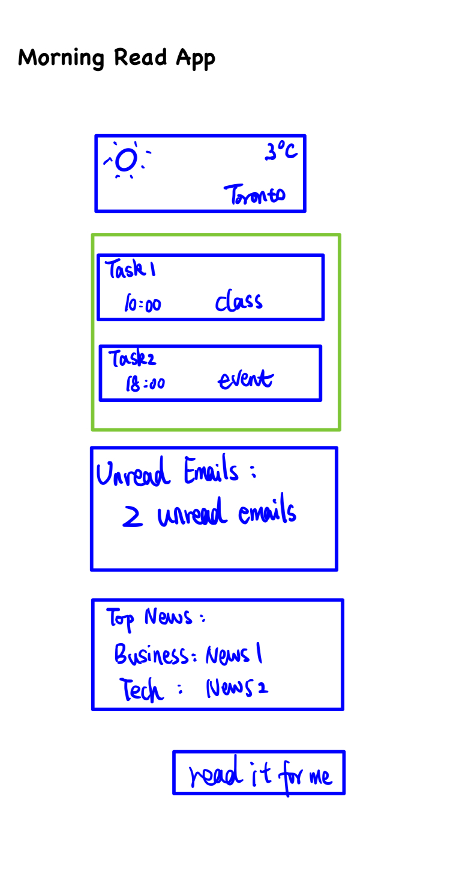

# Morning Read App

## Overview

The Morning Read App is designed to provide users with a centralized platform to gather important information for starting their day. The app will feature modules for displaying weather forecasts, task lists, unread email summaries, and top news headlines, allowing users to efficiently access key information in one place.

### Problem

Issue: Individuals spend significant time visiting multiple sources to gather essential information, leading to inefficiency. The benefits of Morning Read app:

- Time-saving convenience: With busy schedules and multiple sources of information, users often spend valuable time navigating different platforms to gather essential updates. The Morning Read app streamlines this process by consolidating important information into one convenient interface, saving users time and effort.
- Real-time updates: By integrating with external APIs for weather, task management, email, and news, the app provides users with real-time updates and relevant information. 
- Organization and Planning: Starting the day with a clear understanding of the weather forecast, pending tasks, unread emails, and top news stories allows users to prioritize their activities and plan their schedules effectively. 

### User Profile

The Morning Read app addresses a common need for individuals who want to efficiently access key information at the start of their day. 

Users can utilize the Morning Read app in a straightforward and intuitive manner to kickstart their day effectively. Here's a general outline of how users will use the app:

- View Dashboard: users will be directed to their personalized dashboard, where they can view all the selected modules in one consolidated view. 
- Interact with Modules: Users can interact with each module to access more detailed information or take action. For example, they can click on the weather module to view a more comprehensive forecast, mark tasks as complete in the task module, read and respond to emails in the email module, and click on news headlines to read full articles.

- Text-to-Speech (TTS) functionality is also included in the app. Users can enable this feature with a voice command or a button.

### Features

List the functionality that your app will include. These can be written as user stories or descriptions with related details. Do not describe _how_ these features are implemented, only _what_ needs to be implemented.

- Weather forecast: Users can view real-time weather updates for their location.
- Task Management: The app allows users to manage their tasks and to-do lists directly from the dashboard. Users can add, edit, and prioritize tasks, mark them as complete, and set reminders to stay organized and productive throughout the day.
- Email Integration: user can integrate their email accounts with the app to receive summaries of unread emails directly on the dashboard. The email module provides the number of unread emails and it's better to have a quick overview of new messages.
- Top News Headlines: The app aggregates top news headlines from reputable sources and displays them on the dashboard. Users can stay updated on the latest developments in various categories including world news, business, technology, and policy.
- Text-to-Speech functionality: The app can integrate a TTS engine that converts the text displayed on the dashboard into spoken audio.

## Implementation

### Tech Stack

- React
- Express
- Redux
- Client libraries:
  - react
  - React-router
  - axios
- Server libraries:
  - Knex
  - Express

- Frontend: React.js, Redux (for state management), Material-UI (for UI components)
- Backend: Node.js, Express.js
- Database: MongoDB (for storing user preferences and settings)
- Authentication: JWT (JSON Web Tokens) or OAuth 2.0
- External APIs: 
- Other Tools: Axios (for API requests), Lodash (for data manipulation), Moment.js (for date/time formatting)

### APIs

- OpenWeatherMap API (for weather forecasts)

- Task Management API (e.g., Todoist API)
- Email API (e.g., Gmail API)
- News API (e.g., New York Times API)

### Sitemap

- HomePage
  - Weather
  - Tasks
  - Unread Emails
  - Top news
  - TTS

### Mockups

### Data

All Data retrieve from API. In task management, users can import task data from API and create their own task. 

- OpenWeatherMap API (for weather forecasts)

- Task Management API (e.g., Todoist API)
- Email API (e.g., Gmail API)
- News API (e.g., New York Times API)

### Endpoints

GET /weather:

- Get weather by location

Get /tasks

- Get task data (p)

Get /emails

- Get unread emails by date

Get /news

- Get news in various categories and get the top one news each category

Get /news/category/

- Access the summary of the news in a certain category.

### Auth

No. 

## Roadmap

- Create client
  - react project with routes
- Create server
  - express project with routing
- Feature: get weather info from a given location
  - Implement weather component
  - Create /weather endpoint
- Feature: Task management
  - Implement task component
  - Integrate API
  - Create own tasks 
  - create /tasks endpoint
- Feature: Get unread email
  - Implement email component
  - create /emails endpoint
- Feature: Get top news in various categories
  - Implement news component
  - Create /news endpoint
  - Create /news/category/ endpoint
- Feature: Read the text on the dashboard. 
  - Convert the text displayed on the dashboard into spoken audio.

## Nice-to-haves

- **Adjust Settings:** Users can adjust their settings and preferences at any time to fine-tune their morning routine according to their changing needs and preferences. This flexibility allows users to tailor the app to their unique preferences and lifestyle.

- **Auth**: 
  - **Login or Signup:** Users will start by logging into their existing account or signing up for a new one if they're new to the app. This step ensures that their preferences and settings are saved for future use.
  - **Customize Preferences:** Upon logging in, users will have the option to customize their morning routine by selecting which modules they want to include on their dashboard. They can choose from modules such as weather, tasks, unread emails, and top news headlines.
